  

<table>
  <tr>
    <td valign="centre"></td>
    <td valign="top"></td>
  </tr>
</table>

<!-- HERO SECTION -->

  <h3><strong>QA Automation Engineer &rarr; DevOps Engineer</strong></h3>
  
<i>Building reliable Selenium/Java automation frameworks — now bringing that same quality-first mindset to CI/CD, Docker, Kubernetes &amp; AWS.</i>

  

    
    
    
  

  

 

<!-- ABOUT & MEDIA SECTION -->
<h2 align="center">🚀 About Me</h2>

<table width="100%" border="0">
<tr>
<td width="100%" valign="top" style="border: none; background: none;">

### 👨‍💻 Who am I?

* 🎓 **Bachelor of Computer Science (Graduated 2021)** • CMS College of Science and Commerce, Coimbatore
* 🧪 4+ years as a QA Automation Engineer building Selenium/Java frameworks in the logistics domain (FedEx Revenue Execution Portfolio)
* ☁️ Currently transitioning into **DevOps Engineering** through a structured training program (Besant Technologies) — Docker, Kubernetes, Jenkins, AWS
* 📜 Microsoft Certified: **Azure AI Engineer Associate** &nbsp;|&nbsp; Working toward **Azure DevOps Engineer Expert (AZ-400)**

<blockquote>
  

    <i>"I don't just find bugs — I build the pipelines that catch them before they ship."</i>
  

</blockquote>

</td>
</tr>
</table>

<!-- CERTIFICATIONS -->

  

  
  
  

  

---

### 🏅 Achievements

- 🏆 **ACE FY2025 Q2 Shared Success Catalyst Award** — Accenture (Certified Release Team, digital commercial production rollout)
- 📜 **Microsoft Certified: Azure AI Engineer Associate** — Credential ID CBB70CA06B007141 (Earned May 2026)
- 🎯 Reduced automation script maintenance overhead by **30%** with a Selenium/Java Page Object Model framework
- ⚡ Boosted API verification speed by **35%** by streamlining Insomnia workflows
- 📉 Drove a **10%** decrease in post-deployment support tickets across 600+ validations

<!-- SKILLS SHOWCASE -->
<h2>⚡ Tech Stack & Engineering Arsenal</h2>

<table width="100%" align="center">
  <tr>
    <td width="50%" valign="top">
      <h3>🧪 QA & Automation</h3>
      
        
      <h3>☁️ DevOps & Cloud (In Training)</h3>
      
    </td>
    <td width="50%" valign="top">
      <h3>🛠️ Tools</h3>
      

        <code>Selenium WebDriver</code> <code>TestNG</code> <code>Insomnia</code> <code>Splunk (SPL)</code> <code>PuTTY</code> <code>WinSCP</code> <code>ALM</code> <code>Micro Focus Octane</code>
      

      <h3>🗄️ Databases</h3>
      

        <code>SQL</code> <code>SQL Developer</code> <code>Indexing</code> <code>Execution Plans</code> <code>Query Refactoring</code>
      

    </td>
  </tr>
</table>

<!-- KEY PROJECTS / WORK -->
<h2>💼 Key Projects</h2>

<table width="100%">
  <tr>
    <td width="50%" valign="top">
      <h3>🚚 FedEx Revenue Execution Portfolio — Automation</h3>
      
<i>Quality Associate Engineer, Accenture — Bengaluru (Aug 2024 – May 2026)</i>

      

        <code>Selenium WebDriver</code> <code>Java</code> <code>POM</code> <code>Insomnia</code> <code>Splunk</code>
      

      <ul>
        <li>✔ Engineered a scalable Selenium/Java POM framework, cutting script maintenance overhead by 30%</li>
        <li>✔ Overhauled and maintained a suite of 150+ automated scripts across evolving project scopes</li>
        <li>✔ Audited RESTful APIs via Insomnia to isolate bugs before UI integration</li>
        <li>✔ Used Splunk SPL for log analysis and root-cause investigation — foundational DevOps observability experience</li>
      </ul>
    </td>
    <td width="50%" valign="top">
      <h3>🚚 FedEx Revenue Execution Portfolio — QA</h3>
      
<i>Associate Consultant (QA), Eviden — Chennai (Jan 2022 – Aug 2024)</i>

      

        <code>Selenium</code> <code>Insomnia</code> <code>PuTTY</code> <code>SQL</code>
      

      <ul>
        <li>✔ Authored and executed 600+ validations across integration, system &amp; regression phases</li>
        <li>✔ Streamlined API workflows in Insomnia, boosting verification speed by 35%</li>
        <li>✔ Monitored multi-tiered environments via SSH (PuTTY) for early-stage debugging</li>
        <li>✔ Owned the full quality lifecycle from requirement analysis to defect resolution</li>
      </ul>
    </td>
  </tr>
</table>

<!-- ENGINEERING EXPERIENCE -->
<h2>🚀 Engineering Experience</h2>

4+ years across QA automation and quality engineering, now extending into DevOps and infrastructure reliability.

<table width="100%">
  <tr>
    <td width="50%" valign="top">
      <h3>🧪 QA & Automation (Professional)</h3>
      <ul>
        <li>Selenium WebDriver + Java + Page Object Model</li>
        <li>TestNG test orchestration</li>
        <li>API validation with Insomnia</li>
        <li>SQL query optimization &amp; execution plan tuning</li>
        <li>Root-cause analysis with Splunk (SPL)</li>
        <li>Defect lifecycle &amp; Agile methodologies</li>
      </ul>
    </td>
    <td width="50%" valign="top">
      <h3>🛠️ DevOps & Cloud (In Training)</h3>
      <ul>
        <li>Docker &amp; Kubernetes</li>
        <li>Jenkins CI/CD pipelines</li>
        <li>AWS &amp; Microsoft Azure</li>
        <li>Git &amp; GitHub version control</li>
        <li>Shell / Bash scripting</li>
        <li>Linux systems administration</li>
      </ul>
    </td>
  </tr>
</table>

<!-- GITHUB STATS -->
<h2>📈 GitHub Analytics & Open Source Activity</h2>

  
  

  

    
  

  

    
  

